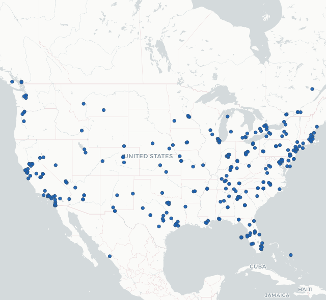
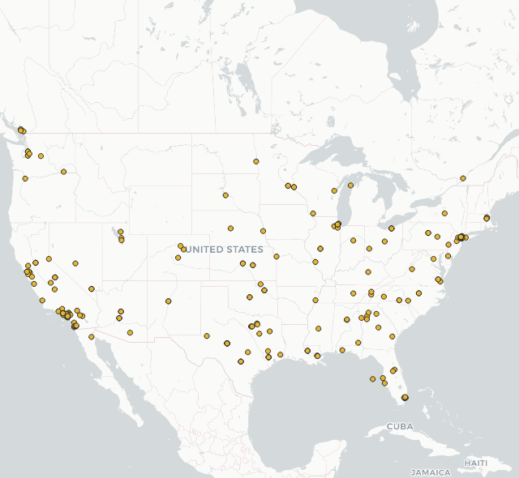
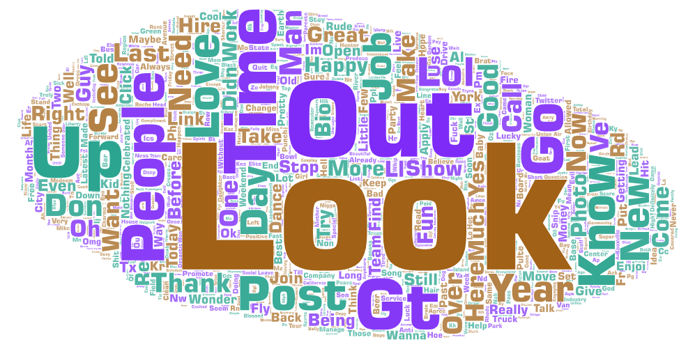
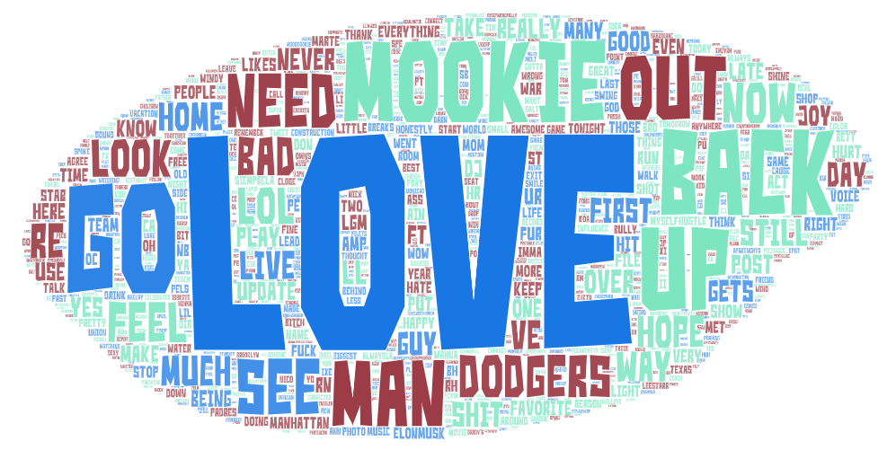

# Geog 458 lab2

## Introduction
In this lab, I compared the real-time tweet messages in the US at two different period of the day which are around 2 pm and 10 pm. First of all, I want to see if the maps present any patterns of active user based on different time zone. Second, I want to find out if the west coast tweet contains different topics than the US as a whole when the east coast tweet becomes inactive.

## Map Comparison
By looking at two different maps, there is pattern of active user locating at different time zone. In the first map which incorpate real-time data at around 2 pm PDT (5 pm EDT), there is approximately equal amount of active tweet message between the east coast and the west coast. However, the second map which recorded data at around 10 pm PDT (1 am EDT) presents a clear difference in the density of the tweet message bewteen the coasts. 

## Word Cloud Comparison
The word clouds also present a very interesting phenomenon. The initial comparison between the word clouds might not bring you to a conclusion. However, if you try to read the smaller words, you see unique keywords like Mookie and Dodgers in the second word cloud. Mookie Betts who is a professional baseball player for Los Angeles Dodgers just won the game against Padres with his team. This piece of information becomes interesting when it links with the geospatial patterns. During the time the second tweet message was recorded, most of the tweet users on the east coast had already gone to sleep which allows the topic that is popular among the west-coast people to stand out.

